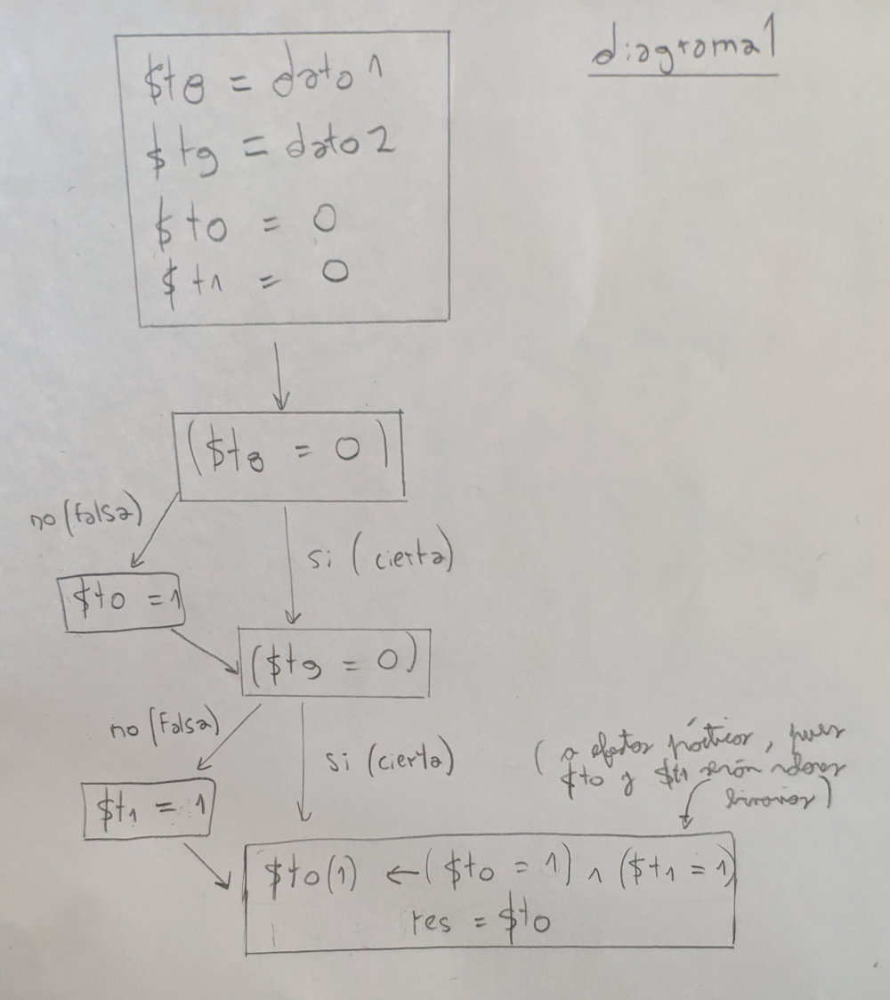

#### 1.1)
Se carga el valor 1, pues 30 < 40.

#### 1.2)
Cambiamos el programa para cargar los valores mencionados, quedando de la siguiente forma:

                .data
    dato1:      .word 50
    dato2:      .word 20
    res:        .space 1
                .text
                lw $t0, dato1($0)
                lw $t1, dato2($0)
                slt $t2, $t0, $t1
                sb $t2, res($0)

Efectivamente, 50 > 20, por que la condición no se cumple, y ahora se carga un 0 en la posición de memoria res.

#### 1.3)
En el 1.1, como dijimos, se compara 30 < 40, que es cierto.
Luego, en el 1.2, se compara 50 < 20, que es falso.

#### 1.4)
Podemos modificar el código nuevamente para almacenar un 1 en res si dato1 y dato2 son iguales:

                .data
    dato1:      .word 30
    dato2:      .word 30
    res:        .space 1
                .text
                lw $t0, dato1($0)
                lw $t1, dato2($0)
                seq $t2, $t0, $t1
                sb $t2, res($0)

Además cambiamos el valor de dato2 para comprobar que al ejecutar el programa, se almacena el valor 1 en la posición de memoria res.

#### 1.5)
Como sabemos, usar la instrucción sge implicaría almacenar un 1 en la posición de memoria res si (dato1 >= dato2).
Sin embargo, nosotros queremos que allí se almacene un 1 sólamente si (dato1 = dato2).
Por lo tanto, podemos además usar la instrucción sle para verificar además si (dato1 <= dato2).
De esta forma, si se cumple que (dato1 >= dato2) con sge, y (dato1 <= dato2) con sle, implica que (dato1 = dato2).
Para escribir un 1 si se cumplen ambas condiciones, haremos uso de la instrucción and.
Con esto en cuenta, el código queda de la siguiente forma:

                .data
    dato1:      .word 30
    dato2:      .word 30
    res:        .space 1
                .text
                lw $t0, dato1($0)
                lw $t1, dato2($0)
                sge $t2, $t0, $t1
                sle $t3, $t0, $t1
                and $t2, $t2, $t3 
                sb $t2, res($0)

Tras probar comparar 30 con los valores 29, 30 y 31, podemos ver que efectivamente, sólo se guarda un 1 en res si los números son iguales (30 y 30).

#### 1.6)
Al ejecutar el fichero en el simulador, se carga el valor 1 en la posición de memoria res.
Esto se debe a que primero, 30 < 40, por lo que la línea con la instrucción slt carga un 1 en el registro $t2.
Luego, como 30 != 40, la instrucción bne salta a la etiqueta fineval, que escribe el 1 almacenado en $t2, a la posición de memoria res.

#### 1.7)
Ejecutando de nuevo el programa con los valores modificados, se carga un 0 en la posición de memoria res.
Esto se debe a que NO se cumple la condición 50 < 20, almacenándose un 0 en el registro $t0.
Luego, como 50 != 20, la instrucción bne salta a la etiqueta fineval, que almacena el valor 0 del registro $t2, en la posición de memoria res.

#### 1.8)
Una vez más modificamos los valores en dato1 y dato2, y ejecutamos el programa como nos es indicado.
Podemos ver que se almacena el valor 1 en la posición de memoria res.
Esto se debe a que, primero, NO es cumple la condición 20 < 20 en la instrucción slt, por lo que se almacena un 0 en el registro $t0.
Sin embargo, como 20 = 20, la instrucción bne NO salta a fineval, y continúa con la siguiente instrucción ori.
Ésta incondicionalmente establece el valor de $t2 en 1.
Finalmente, se ejecuta la instrucción sb, que almacena dicho 1 antes almacenado en $t2, en la posición de memoria res.

#### 1.9)
En conclusión, se evalúa que (dato1 <= dato2).

#### 1.10)
Podemos evaluar esta misma comparación con la pseudoinstrucción sle, quedándonos el código de la siguiente forma:

                .data
    dato1:      .word 20
    dato2:      .word 20
    res:        .space 1
                .text
    main:       lw $t0, dato1($0) 
                lw $t1, dato2($0)
                sle $t2, $t0, $t1 
    fineval:    sb $t2, res($0) 

#### 1.11)
Modificamos el código original para cumplir con la consigna:

                .data
    dato1:      .word 50
    dato2:      .word 50
    res:        .space 1
                .text
    main:       lw $t0, dato1($0)
                lw $t1, dato2($0)
                sgt $t2, $t0, $t1
                bne $t0, $t1, fineval
                ori $t2, $0, 1
    fineval:    sb $t2, res($0)

Como podemos ver, tan solo debemos cambiar la instrucción slt por sgt.

#### 1.12)
También es más sencillo usar directamente la pseudoinstrucción sge:

                .data
    dato1:      .word 50
    dato2:      .word 50
    res:        .space 1
                .text
    main:       lw $t0, dato1($0)
                lw $t1, dato2($0)
                sge $t2, $t0, $t1
    fineval:    sb $t2, res($0)

#### 1.13)
Al ejecutar el programa, vemos que se carga el valor 1 en la posición de memoria res.
El motivo por el cual esto sucede, es que como 40 != 0, la primera instrucción beq NO salta a la etiqueta igual, ejecutándose la siguiente instrucción ori que incondicionalmente guarda un 1 en el registro $t0.
Similarmente, -50 != 0, por lo que tampoco salta la segunda instrucción beq, incondicionalmente almacenándose un 1 en el registro $t1 por la instrucción ori en la línea siguiente.
Como $t0 y $t1 tienen un 1, el and almacena un 1 en $t0, el cual luego se almacena en la posición de memoria res.

#### 1.14)
Cambiando los valores del programa según se especifica, esta vez se almacena el valor 0 en la posición res.
Esto se debe a que como 0 = 0 (dato1), el valor en el registro $t0 queda en 0 (pues se inicializa al comienzo del programa) dado que la primera instrucción beq salta a la etiqueta igual, así entonces no ejecutándose la instrucción ori que le sigue.
Como consecuencia de esto, al ejecutar la instrucción and, hay al menos uno de los registros que tiene el valor 0, guardando el 0 en $t0 como resultado.
Luego este 0 antes guardado se almacena en la posición res.

#### 1.15)
De forma similar al ejercicio anterior, al ser uno de los valores igual a 0 (en este caso, dato2), el beq correspondiente salta a fineval, evitando que se almacene un 1 en el registro $t1 (quedando este en 0).
Por lo tanto, luego la instrucción and almacena un 0 en el registro $t0, el cual luego se almacena en la posición res.

#### 1.16)
Finalmente, con los dos valores de dato1 y dato2 en 0, las dos instrucciones beq saltan impidiendo que se almacene un 1 en los registros $t0 y $t1.
Como estos registros quedan en 0, el and al final guarda un 0 en $t0, y así luego se almacena en la posición res.

#### 1.17)
En conclusión, se evalúa que tanto dato1 como dato2, almacenen un valor distinto de 0. O sea, (dato1 != 0) and (dato2 != 0).
Si esto es cierto, se almacena un 1 en res.
De lo contrario (dato1 = 0) ó (dato2 = 0), se almacena un 0 en res.

#### 1.18)
Como ya almacenamos un 1 en $t0 si (dato1 != 0), entonces tenemos que modificar la segunda de las comparaciones.
Si cambiamos el segundo argumento de la segunda instrucción beq, de $0 a $t8, directamente estaríamos saltando si son iguales. Es decir, si fuesen distintos, no saltaríamos, y se almacenaría un 1 en $t1.
Luego el and del código original verificaría que las dos condiciones se cumplen.
Así, el código modificado resulta de la siguiente forma:

                .data
    dato1:      .word 40
    dato2:      .word -50
    res:        .space 1
                .text
    main:       lw $t8, dato1($0)
                lw $t9, dato2($0)
                and $t0, $t0, $0
                and $t1, $t1, $0
                beq $t8, $0, igual
                ori $t0, $0, 1
    igual:      beq $t9, $t8, fineval
                ori $t1, $0, 1
    fineval:    and $t0, $t0, $t1
                sb $t0, res($0)

#### 1.19)
Tras ejecutar el programa, se carga el valor 1 en la posición de memoria res.
Esto se debe a que, primero, como NO se cumple que 30 = 0, la instrucción beq NO salta, ejecutándose ori, que incondicionalmente establece el valor de $t0 en 1.
Luego, como -50 < 30, se cumple la condición para slt, escribiéndose un 1 en el registro $t1.
Como hay un 1 en los registros $t0 y $t1, el and al final almacena un 1 en $t0, que luego se guarda en la posición res.

#### 1.20)
En este caso, vemos que se carga el valor 0 en la posición de memoria res.
Por un lado, NO se cumple que 10 = 0, por lo que NO se ejecuta la primera instrucción beq, ejecutándose la posterior instrucción ori que guarda un 1 en el registro $t0.
Por otro lado, NO se cumple que 20 < 0, por lo que la instrucción slt almacena un 0 en el registro $t1.
Si bien el valor de $t0 es 1, como el de $t1 es 0, el and almacena un 0 en el registro $t0, que luego se guarda en la posición res.

#### 1.21)
Nuevamente, se almacena un 0 en la posición de memoria res.
Para esta situación, SI se cumple que 0 = 0 para el primer beq, saltándose el ori que establecía un 1 en el registro $t0, quedándose este en 0 (porque así fue inicializado al comienzo del programa).
De todas formas, si se cumple que -20 < 0, por lo que la instrucción slt almacena un 1 en el registro $t1.
Así, como uno de los dos registros $t0 y $t1 tiene un valor establecido en 0, se almacena un 0 en $t0, y así también en la posición de memoria res.

#### 1.22)
En conclusión, se evalúa que el primer valor sea DISTINTO de 0, y que el segundo valor sea menor al primero.
Es decir: (dato1 != 0) and (dato1 < dato2).

#### 1.23)
Podemos lograr la consigna con dos simples modificaciones:
- Modificamos el segundo argumento de la instrucción beq de un $0 a un $t9, así la instrucción beq saltando si los datos son iguales. Es decir, si son distintos los datos, el código continúa ejecutando la instrucción ori que le sigue, estableciendo el registro $t0 con el valor 1.
- Agregamos una instrucción xori con el valor inmediatio 1, para negar (obtener el opuesto) el resultado de la instrucción slt (el registro $t1). Esto se debe a que si NO es cumple que $t1 < $t0, claramente entonces $t1 >= $t0 ($t0 <= $t1).

El código resulta de la siguiente forma:

                .data
    dato1:      .word 0
    dato2:      .word -20
    res:        .space 1
                .text
    main:       lw $t8, dato1($0)
                lw $t9, dato2($0)
                and $t1, $t1, $0
                and $t0, $t0, $0
                beq $t8, $t9, igual
                ori $t0, $0, 1
    igual:      slt $t1, $t9, $t8
                xori $t1, $t1, 1
    fineval:    and $t0, $t0, $t1
                sb $t0, res($0)

#### 1.24)
[Interpetando "el código anterior", como lo propuesto en el #### 1.23), siendo que la consigna no es del todo clara, además que es interesante proponer la alternativa de usar not en el ejercicio anterior]

Podemos cambiar la segunda modificación del punto anterior.
En vez de agregar una instrucción xori, reemplazamos directamente la instrucción slt por sle, y damos vuelta de lugar los argumentos $t9 y $t8.
Así estamos directamente almacenando un 1 en $t0 si $t8 <= $t9 (dato1 <= dato2).

Entonces, el código resulta de la siguiente forma:

                .data
    dato1:      .word 0
    dato2:      .word -20
    res:        .space 1
                .text
    main:       lw $t8, dato1($0)
                lw $t9, dato2($0)
                and $t1, $t1, $0
                and $t0, $t0, $0
                beq $t8, $t9, igual
                ori $t0, $0, 1
    igual:      sle $t1, $t8, $t9
    fineval:    and $t0, $t0, $t1
                sb $t0, res($0)

#### 1.25)
Al ejecutar el programa, vemos que se guarda un 0 en la posición de memoria res.
Esto se debe a que, primero, NO se cumple 30 < -20, entonces la instrucción slt almacena un 0 en la instrucción $t0.
Luego, como -20 != 0, la instrucción bne salta a la etiqueta fineval, no ejecutándose la instrucción ori que le sigue, y quedando el valor de $t1 en 0 (inicializado al comienzo del programa).
Como tanto $t0 como $t1 tienen valor 0, el resultado de la instrucción or será 0, que se almacena en $t0, y así entonces en la posición res.

#### 1.26)
En este caso, se guarda un 1 en la posición de memoria res.
Por un lado, -20 < 10, entonces la instrucción slt almacena un 1 en la posición de memoria $t0.
Mientras, como 10 != 0, la instrucción bne salta sin ejecutar la instrucción ori que le sigue, quedando $t1 con el valor 0.
Como al menos uno de los registros $t0 y $t1 tiene un valor 1 (el registro $t0), entonces la instrucción or guarda un 1 en $t0, que luego se almacena en la posición res.

#### 1.27)
Nuevamente, se almacena un 1 en la posición de memoria res.
Para esta situación, NO se cumple que 10 < 0, por lo que se guarda un 0 en el registro $t0 (instrucción slt).
Sin embargo, NO se cumple que 0 != 0 ($t9 != 0), en consecuencia la instrucción bne NO salta, ejecutándose la instrucción ori que le sigue, la cual incondicionalmente guarda un valor 1 en el registro $t1.
Como uno de los dos valores en los registros $t0 y $t1 es 1 (el registro $t1), entonces la instrucción or almacena un 1 en el registro $t0, que luego se almacena en la posición de memoria res por la instrucción sb.

#### 1.28)
Finalmente, en este último caso, se almacena un 0 en la posición de memoria res.
Primero, NO se cumple que 20 < 10, por lo que la instrucción slt almacena un 0 en el registro $t0.
Mientras, TAMPOCO se cumple que 10 = 0, por lo que la instrucción bne se cumple (!= 0), saltando a la etiqueta fineval, y no se ejecuta la instrucción ori que le sigue. Como consecuencia, el valor de $t1 queda en 0 (antes inicializado).
Siendo ambos valores de los registros $t0 y $t1, 0, entonces la instrucción or almacena también un 0 en $t0. Este valor 0 luego se guarda en la posición de memoria res.

#### 1.29)
En conclusión, el programa verifica que dato1 sea menor que dato2, Ó que dato2 sea igual a 0.
Es decir: (dato1 < dato2) or (dato2 = 0).

#### 1.30)
Para modificar la condición evaluada según se indica en el ejercicio, podemos hacer las siguientes modificaciones al código original:
- Invertimos el orden de los argumentos de la instrucción slt ($t8 y $t9), de forma que se almacene un 1 en $t0 cuando (dato2 < dato1). Luego, como queremos que el registro mantenga un 1 si NO se cumple la condición anterior (pues si NO se cumple (dato2 < dato1), entonces (dato2 >= dato1)), agregamos una instrucción xori que con el valor inmediato 1, nos permita invertir el resultado antes almacenado en $t0. 
- Primero reemplazamos el primer argumento de la instrucción bne de $t9 a $t8, ya que la segunda condición se tiene que aplicar sobre el valor de dato1, y no dato2. Luego, como queremos que se establezca un 1 en el registro $t1 si (dato1 <= 0), siendo que sucede cuando NO se cumple la condición en el branch, podemos cambiar esta instrucción de bne a bgtz. Esto logrará que se evite la instrucción ori cuando (dato1 > 0), quedando un 0 en el registro $t1. Mientras, si resulta que (dato1 <= 1), la instrucción de branch NO saltará, estableciéndose un 1 en el registro por la posterior ejecución de ori.

Cabe aclarar que para usar la instrucción bgtz, debemos prescindir del segundo argumento $0, así indicando únicamente el registro y la etiqueta de la instrucción.

El código resulta entonces de la siguiente forma:

                .data
    dato1:      .word 30
    dato2:      .word -20
    res:        .space 1
                .text
    main:       lw $t8, dato1($0)
                lw $t9, dato2($0)
                and $t0, $t0, $0
                and $t1, $t1, $0
                slt $t0, $t9, $t8
                xori $t0, 1
                bgtz $t8, fineval
                ori $t1, $0, 1
    fineval:    or $t0, $t0, $t1
                sb $t0, res($0)

#### 1.31)
[Interpretamos que el código anterior es el de la Cuestión 1.30)]

Podemos simplificar la primera de las modificaciones planteadas usando la instrucción sle. En vez de invertir los argumentos y agregar una instrucción not, podemos directamente usar sle para almacenar si se cumple que (dato1 <= dato2) en el registro $t0.

Con este cambio, el código resulta de la siguiente forma:

                .data
    dato1:      .word 30
    dato2:      .word -20
    res:        .space 1
                .text
    main:       lw $t8, dato1($0)
                lw $t9, dato2($0)
                and $t0, $t0, $0
                and $t1, $t1, $0
                sle $t0, $t8, $t9
                bgtz $t8, fineval
                ori $t1, $0, 1
    fineval:    or $t0, $t0, $t1
                sb $t0, res($0)
