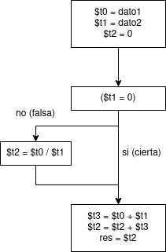
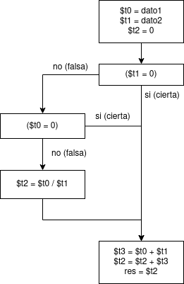
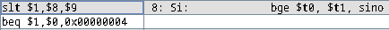
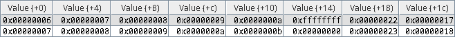

#### 2.1)

La instrucción que evalúa la condición y controla el flujo del programa es `beq`, pues en el caso en el que el valor almacenado en `$t1` sea igual 0, salta las dos instrucciones debajo de la etiqueta "entonces". De esta forma, estas dos sólo se ejecutan cuando **no** se cumple que `$t1` = 0, es decir, cuandop `$t1` != 0, tal como lo leemos en el if del pseudocódigo.

Dichas dos líneas precisamente se encargan de ejecutar lo que en el pseudocódigo vemos como la división entre `$t0` y `$t1`, primero realizándose la operación con la instrucción `div`, y luego almacenándose el resultado en `$t2` con la instrucción `mflo`.
Más allá de haberse ejecutado las instrucciones o no, según el resultado de evaluar la condición, las operaciones al final se realizan de cualquier forma. La diferencia está en que como deben de sumarse más de dos valores, en Assembly se requieren de dos instrucciones `add` que sumen primero `$t0` y `$t1`, y luego `$t2` a aquel resultado.

Finalmente debe de almacenarse el valor en memoria, por lo que aquello que en código sólo vemos como variables, requiere una instrucción final `sw` que guarde el valor en la posición de memoria "res".

#### 2.2)

La instrucción `beq` y el uso de etiquetas implementan la estructura condicional _if-then_. Esto lo podemos ver en cómo para `beq` en la etiqueta "Si", vimos ya que se evalúa la condición **inversa** a la cual se quiere ejecutar lo que le sigue a la etiqueta "entonces". Esto logra evitar estas instrucciones, saltando a la etiqueta "finsi" en el caso en que no se cumpla la condición.

Así, la instrucción `beq` (en la línea a la cual apunta la etiqueta "Si"), junto con las etiquetas "entonces" y "finsi", implementan la estructura _if-then_.

#### 2.3)

Tras ejecutar el programa, podemos comprobar que el valor almacenado en la variable "res" es **`0x47`**, o en decimal, **71**.

Esto lo podemos reafirmar observando el comportamiento del programa. Sabemos ya, que siempre se van a sumar al resultado a guardarse, los valores en `$t0` y `$t1`: "dato1" y "dato2". Por lo tanto, desde el vamos, el valor será al menos 40 + 30 = 70.

Luego, como 30 != 0, se almacena en `$t2` el resultado de la división floor(40 / 30) = 1.

Entonces, al sumar los 3 valores (los datos y el resultado de la división), 40 + 30 + 1 = 71, tal como lo vimos al ejecutar el programa.

#### 2.4)

En el caso en el que "dato2" = 0, la instrucción `beq` saltaría la división `$t0`/`$t1`, continuando por la etiqueta "finsi", y sólo se almacenaría la suma de "dato1" y "dato2" en la posición de memoria "res". Considerando que sabemos ya que "dato2" = 0, en la práctica el valor de "res" entonces sería directamente el mismo que el de "dato1".

A continuación, el diagrama de flujo correspondiente a la estructura de control implementada en el código:

<div align="center">
    </img>
</div>

#### 2.5)

Podemos ver que la única diferencia entre el pseudocódigo presentado en la [Cuestión 2.1)](#21) y la Cuestión actual, es la condición dentro del if. Por lo tanto, podemos modificar el programa en Assembly antes visto para poder acomodar a esta diferencia: reemplazamos la instrucción `beq` por `ble`, de forma que el salto que _evite_ la división, se haga **si** se cumple que `$t1` <= 0 ("dato2" <= 0).

Así, cuando la condición **no** se cumpla, será si `$t1` > 0, en este caso sí ejecutándose las instrucciones `div` y `mflo`, entonces cumpliendo con lo estipulado en el pseudocódigo.

Con esto en cuenta, el programa modificado resulta de la siguiente forma:

```assembly
            .data
dato1:      .word 40
dato2:      .word 30
res:        .space 4
            .text
main:       lw $t0, dato1($0)
            lw $t1, dato2($0)
            and $t2, $t2, $0
Si:         ble $t1, $0, finsi
entonces:   div $t0, $t1
            mflo $t2
finsi:      add $t3, $t0, $t1
            add $t2, $t3, $t2
            sw $t2, res($0)
```

#### 2.6)

<pre>
<b>VARIABLES</b>
    <b>ENTERO</b>: dato1=40; dato2=30; res;
<b>INICIO</b>
    <b>Si</b> (dato2 != 0)
        <b>Si</b> (dato1 != 0)
            res = dato1 / dato2;
    res = res + dato1 + dato2;
<b>FIN</b>
</pre>

#### 2.7)

Las instrucciones que, en este caso, evalúan la condición y controlan el flujo del programa, son las dos instruciones `beq` en las líneas siguientes a la etiqueta "Si". Ambas saltan a la etiqueta "finsi" si se da tanto que `$t1` = 0 ("dato1" = 0), o si `$t2` = 0 ("dato2" = 0), respectivamente.

De esta forma, las instrucciones que se encuentran a partir de la etiqueta "entonces", sólo se ejecutan si no se dan ninguna de las condiciones mencionadas. Esto se debe a que es necesario pasar ambas de largo (que no salten), para que se ejecuten las líneas siguientes a la etiqueta en cuestión, es decir, la división entre `$t0` y `$t1`. Para que suceda entonces, se tiene que dar que `$t1` != 0 **y** `$t2` != 0 (ambos datos con valores _distintos_ a 0).

En el pseudocódigo, estas instrucciones toman el rol de los dos _Si_ anidados que allí vemos.

Aclarar que más allá de que alguna de las condiciones se dé o no, las instrucciones partiendo desde la etiqueta "finsi" se ejecutarán incondicionalmente. Éstas se corresponden en el pseudocódigo de forma prácticamente idéntica a cómo fue descrito en la [Cuestión 2.1)](#21).

#### 2.8)

Con lo visto en la anterior Cuestión, podemos concluir que el conjunto de instrucciones que implementan la estructura condicional _if-then_ son las `beq` antes mencionadas, en conjunto con la etiqueta "finsi" (y opcionalmente, como punto de referencia pero sin un rol funcional, las etiquetas "Si" y "entonces").

Justamente, los `beq` cumplen la parte del _if_, mientras que lo que sigue a la etiqueta "entonces" cumple la parte del _then_. Además, "finsi" cumple el rol de delimitar las instrucciones por fuera del _if_, y proporcionar un punto de salto del cual continuar si las condiciones de la etiqueta "Si" **no** se cumplen.

A continuación, el diagrama de flujo del funcionamiento del programa, que demuestra la lógica detrás la estructura de control _if-then_ vista:

<div align="center">
    </img>
</div>

#### 2.9)

Al ejecutar el programa, vemos que de forma similar a la [Cuestión 2.1)](#21), se almacena el valor **`0x47`**, o en decimal, **71**.

Analizando el comportamiento del código, como también considerando el análisis previo del mismo, primero debemos tener en cuenta que siempre se suman los dos datos a lo que luego resulta en el valor de "res". Luego, sólo se le sumará también el valor de la división entre `$t0` y `$t1`, si es que tanto `$t0` _como_ `$t1` son **distintos** de cero (es decir, ambos datos son distintos de cero). Esto es porque, como ya dijimos, cuando ambos cumplan esta condición, las instrucciones `beq` no saltarán, y se ejecutarán las líneas siguientes a la etiqueta "entonces".

Esto lo diferencia del código visto en la Cuestión 2.1), en el cual se sumaba el resultado de la misma división, sólo si `$t1` != 0 ("dato2" != 0), sin restricciones sobre `$t0`.

Como tanto "dato1" y "dato2" son distintos de cero, se produce el mismo efecto visto en la Cuestión antes referenciada, almacenando el resultado de 40 + 30 + floor(40/30) = 70 + 1 = 71.

#### 2.10)

Probando correr el código con los valores indicados para "dato1" y "dato2", vemos que resulta en que el otro valor distinto sea almacenado en "res". Esto es muy similar a lo ya explicado en la [Cuestión 2.4)](#24).

En resumen, como sabemos que el valor de "res" contiene la suma de los dos datos, si alguno de ellos es igual a cero, en primera instancia implica que no va a afectar a la suma, efectivamente siendo equivalente a sumar directamente el otro número con un valor distinto de cero. Además de esto, dadas las condiciones establecidas para que se ejecute el código que le sigue a la etiqueta "entonces", si cualquiera de los datos es igual a cero, siquiera se suma el resultado de la división entre ellos, constribuyendo a que no haya ningún otro sumando para el valor a almacenar en "res".

De esta forma, si cualquiera de los datos tiene un valor = 0, el valor de "res" es igual al de la suma de los datos. Y sabiendo que al menos uno de los datos es 0, resulta prácticamente en copiar el valor del dato != 0. Por supuesto, si ambos datos fueran = 0, el valor de "res" también sería 0.

#### 2.11)

El programa descrito en pseudocódigo sólo se diferencia del ya visto en la [Cuestión 2.6](#26) por las condiciones en el if. Si bien en el caso citado usábamos dos ifs anidados para representar las dos condiciones, usar el operador lógico _and_ como lo es en este caso debería tener el mismo resultado. Por lo tanto, las diferencias yacen en la comparaciones que se hacen entre los datos y 0.

Mientras antes comparábamos por si los datos eran distintos de cero, ahora estas condiciones cambian. De todas formas, nos es relativamente sencillo cambiar las instrucciones para acomodar a estas discrepancias:

- Podemos cambiar la primera instrucción `beq` por `blt`, de forma que se salte cuando se cumpla que ("dato2" < 0). Es decir, **no** se saltaría (porque se cumple la condición deseada), si ("dato2" >= 0), según se lo describe en el pseudocódigo.
- También habría que cambiar la segunda instrucción `beq` por `ble`. En este caso, saltaría cuando se cumple que ("dato1" <= 0). Así, **no** se saltaría cuando ("dato1" > 0), tal como se indica en el pseudocódigo.

Con esto en cuenta, el código resultante es el siguiente:

```assembly
            .data
dato1:      .word 40
dato2:      .word 30
res:        .space 4
            .text
main:       lw $t0, dato1($0)
            lw $t1, dato2($0)
            and $t2, $t2, $0
Si:         blt $t1, $0, finsi
            ble $t0, $0, finsi
entonces:   div $t0, $t1
            mflo $t2
finsi:      add $t3, $t0, $t1
            add $t2, $t3, $t2
            sw $t2, res($0)
```

#### 2.12)

<pre>
<b>VARIABLES</b>
    <b>ENTERO</b>: dato1=30; dato2=40; res;
<b>INICIO</b>
    <b>Si</b> (dato1 < dato2)
        res = dato1;
    <b>Sino</b>
        res = dato2;
    <b>FinSi</b>
<b>FIN</b>
</pre>

#### 2.13)

Tras ejecutar el programa, el valor almacenado es "res" es **`0x1e`**, o en decimal, **30**.
En cambio, cuando "dato1" = 35, el valor almacenado en "res" es **`0x23`**, o en decimal, **35**.

Como podemos ver, en ambos casos se almacena el valor de "dato1" en la posición de memoria "res". Esto se debe a que, como ya vimos en el la Cuestión anterior, si "dato1" < "dato2", se almacena "dato1" en "res". Como tanto 30 < 40, y 35 < 40, entonces en ambos casos de guardó el valor de "dato1", dentro de la posición "res".

#### 2.14)

Analizando las instrucciones del panel de segmento de texto, tras haber ensamblado el programa, podemos identificar las instrucciones que implementan la pseudoinstrucción `bge`.

<div align="center">
    </img>
</div>

Como se puede apreciar en la imagen, `bge` lo implementan las instrucciones `slt` y `beq`.

Primero, se almacena en el registro temporal del ensamblador `$at` (`$1`), el resultado de comprobar si (`$t0` < `$t1`). Luego, si este no es el caso, entonces claramente se cumple que (`$t0` >= `$t1`). Por lo tanto, con la instrucción `beq`, se verifica que el resultado de la comparación sea 0 (usando el registro `$0`), de forma tal que se salte a la etiqueta "sino", bajo la condición establecida por `bge`.

#### 2.15)

Debido a las diferencias entre el programa descrito y el código anteriormente visto, las modificaciones para adaptarlo al ejercicio son más significativas. Por lo tanto, nos tomaremos una mayor libertad para poder implementarlo:

```assembly
            .data
dato1:      .word 30
dato2:      .word 40
res:        .space 4
            .text
main:       lw $t0, dato1($0)
            lw $t1, dato2($0)
Si:         blt $t0, $t1, sino
entonces:   sub $t1, $0, $t1       # opposite of dato1
            j finsi
sino:       sub $t0, $0, $t0       # opposite of dato2
finsi:      add $t0, $t0, $t1
            sw $t0, res($0)
```

En resumen, primero debemos modificar la comparación del "Si", usando la instrucción `blt` que saltará cuando "dato1" < "dato2", es decir, el "entonces" se ejecutará cuando "dato1" >= "dato2".

Luego, como debemos almacenar la resta entre los números, podemos obtener el opuesto del número que reste en cada caso haciendo la cuenta 0 - "datoX" con la instrucción `sub`. Así, sumarlos luego con la instrucción `add` es equivalente a guardar la resta entre los datos, según corresponda.

#### 2.16)

<pre>
<b>VARIABLES</b>
    <b>ENTERO</b>: dato1=30; dato2=40; dato3=-1; res;
<b>INICIO</b>
    <b>Si</b> ((dato3 < dato1) or (dato3 > dato2))
        res = 1;
    <b>Sino</b>
        res = 0;
    <b>FinSi</b>
<b>FIN</b>
</pre>

#### 2.17)

Tras ejecutar el programa, el valor almacenado en "res" es **1**. También así sucede si intercambiamos los valores de los primeros dos datos.

Como "dato3" = -1, en ambos casos "dato3" < "dato1" (pues tanto "dato1" como "dato2" son positivos). En consecuencia, siempre se cumple la condición en la instrucción `blt`, que salta a la etiqueta "entonces", estableciendo el valor del registro `$t4` en 1, el cual luego se almacenará en "res".

#### 2.18)

Una vez más, con algunas modificaciones al código visto en la [Cuestión 2.16](#216), podemos implementar el programa descrito en Assembly:

```assembly
            .data
dato1:      .word 30
dato2:      .word 40
dato3:      .word -1
res:        .space 4
            .text
main:       lw $t1, dato1($0)
            lw $t2, dato2($0)
            lw $t3, dato3($0)
Si:         blt $t3, $t1, sino      # if dato3 < dato1, the condition is not met
            bgt $t3, $t2, sino      # if dato3 > dato2, the condition is not met
entonces:   addi $t4, $0, 1
            j finsi
sino:       and $t4, $0, $0
finsi:      sw $t4, res($0)
```

Para hacer cumplir ambas condiciones como si fuera un _and_ en vez de un _or_ como era antes, ambas instrucciones de branch deberán saltar a la etiqueta "sino". Luego, como éstas llevan a ejecutar el código cuando **no** se cumple la condición, deben de evaluar el criterio _opuesto_ al establecido en el _Si_.

Por lo tanto, la primera instrucción `blt` verifica si ("dato3" < "dato1"), ya que si así fuera, entonces NO se cumpliría que ("dato3" >= "dato1") como se especifica en el pseudocódigo, entonces llevando directamente a la instrucción posterior a la etiqueta "sino".

Mientras, si esta condición **no** se cumpliera (es decir, **sí** se cumple la que deseamos para el _Si_), se evaluaría la segunda instruccioón de branch, `bgt`, que verifica si ("dato3" > "dato2"). Si este fuera el caso, no se cumpliría que ("dato3" <= "dato2"), por lo que una vez más, nos lleva a ejecutar el caso "sino".

Si esta condición tampoco se cumpliera (es decir, **sí** se cumple la que queremos para el _Si_), entonces ambas condiciones se hubieran cumplido como las queremos, ejecutándose las líneas posteriores a la etiqueta "entonces".

Por todo lo explicado, el programa anterior implementa aquel descrito en el enunciado en "lenguaje algorítmico".

#### 2.19)

Las funciones de cada una de las instrucciones que cumplen el programa son:

- **`la`**: Carga la dirección de memoria del primer caracter de "cadena" en el registro `$t0`.
- **`andi`**: Establece el valor en el registro `$t2` = 0.
- **`lb`**: Carga desde la memoria el byte correspondiente al caracter de "cadena" al cual apunta el registro `$t0`. En el primer ciclo del _while_, este será el primer caracter, luego el segundo en el ciclo siguiente, y así sucesivamente.
- **`beq`**: Saltará por fuera del ciclo actual de la estructura _while_ (efectivamente terminando con las iteraciones de esta estructura), bajo la condición que el byte leído de "cadena" en `$t1` sea = 0. Este será el caso si se llega al fin de la cadena, concretamente al caracter posterior al último, conocido como _terminador_.  Sabiendo que los carateres se representan numéricamente en la memoria con su equivlente en ASCII, no habrá otro caracter más allá del terminador que tenga el valor 0 en ASCII. Incluso el caracter "0" realmente tiene el número 48 en ASCII. Podemos también comprobar por la existencia de este terminador, observando la disposición de la memoria del código ensamblado: a pesar de la cadena "hola" ocupar 4 bytes (1 por cada caracter), usando la directiva `.align 2`, el espacio de "n" se alinea desde la dirección de memoria `0x10010008`, en vez de la `0x10010008`, mostrando la existencia de un quinto byte con valor `0x00` en la dirección `0x10010004`.
- **`addi`**: Las dos instrucciones `addi` suman un 1 a los registros `$t2` y `$t0`. Como `$t0` es una dirección de memoria que apunta inicialmente al primer caracter de "cadena", esta suma lo desplazará a apuntar al segundo caracter de "cadena", y así luego con los caracteres subsiguientes para los próximos ciclos de la estructura _while_. Mientras, sumarle un 1 a `$t2`, que originalmente comienza = 0, hará que éste mantenga la cantidad de ciclos realizados hasta este punto.
- **`j`**: Esta instrucción salta incondicionalmente de vuelta al comienzo de la estructura _while_, a la etiqueta "mientras", donde se lee el próximo byte de la cadena y se comprueba la condición.
- **`sw`**: Finalmente, esta última instrucción almacenará el valor acumulado en `$t2`, la cantidad de iteraciones realizadas, en la posición de memoria "n".

#### 2.20)

En conclusión, en "n" se almacena la cantidad de iteraciones realizadas por la estructura _while_ en el código Assembly. Esta cantidad de vueltas es equivalente al largo de "cadena", ya que la condición para que deje de ejecutarse la estructura es que el caracter encontrado sea igual a 0, es decir, llegar al terminador, el final de la cadena tras haberla recorrido caracter por caracter.

En concreto, para este caso, el valor almacenado en la posición de memoria "n" es **4**, pues precisamente, "cadena" tiene un largo de 4 caracteres.

#### 2.21)

Debido a las numerosas diferencias entre lo implementado en el código Assembly original, con lo que se nos requiere implementar en el ejercicio, no mencionaremos las modificaciones necesarias para llegar a la solución:

```assembly
                .data
tira1:          .asciiz "hola"
tira2:          .asciiz "adios"
                .align 2
n:              .space 4

                .text
main:           la $t0, tira1
                la $t1, tira2
                andi $t3, $t3, 0
        
mientras:       lb $t2, 0($t0)
                beq $t2, $0, finmientras    # tira1[i] = 0?
                lb $t2, 0($t1)
                beq $t2, $0, finmientras    # tira2[i] = 0?
        
                addi $t3, $t3, 1
                addi $t0, $t0, 1
                addi $t1, $t1, 1
                j mientras
        
finmientras:    sw $t3, n($0)
```

#### 2.22)

> **CORRECCIÓN DEL EJERCICIO:** El código Assembly provisto inicializa el valor de `$t1` en 6, cuando realmente debería ser 5. Si bien los resultados no cambian, porque un ciclo adicional del _for_ sólo suma 0 dado que la memoria se limpia cada vez que se ensambla un nuevo programa, este último ciclo es innecesario. Por lo tanto, consideraremos para la resolución de las Cuestiones posteriores, que el código hace la cantidad de iteraciones justa para el largo de "vector".

El rol de cada una de las instrucciones que componen el programa son las siguientes:

- **`la`**: Carga en el registro `$t2` la dirección de memoria del primer elemento de "vector".
- **`and`**: Inicializa el valor del registro `$t3` en 0.
- **`li`**: Ambas instrucciones `li` cargan los valores 0 y 5 en los registros `$t0` y `$t1` respectivamente.
- **`bgt`**: Comprueba la condición del _for_, y romperá con el ciclo actual en el caso en el que (`$t0` > `$t1`). Es decir, cuando el valor de `$t0`, el contador de iteraciones de la estructura, supere a la cantidad establecida en el registro `$t1` (en este caso, 5), entonces allí la instrucción `bgt` saltará por fuera de la estructura del _for_, a la etiqueta "finpara". Dado que `$t0` comienza en 0, y que cumple la condición evaluada cuando `$t1` > 5, entonces se realizarán 6 iteraciones: desde la 0° a la 5°. Por esto, en el pseudocódigo, decimos "Para i=0 hasta 5...".
- **`lw`**, En cada iteración, carga en el registro `$t4` el valor del número ubicado en la posición del vector a la que apunta `$t2`. Como ya veremos que `$t2` avanza de a 4, implica que `$t4` tendrá el valor de "vector" en la `$t0`-ésima posición.
- **`add`**: El registro `$t3`, originalmente inicializado en 0, mantendrá el resultado de la suma de los elementos del vector. En cada iteración, esta instrucción hace que se le sume el valor de `$t4`, el valor del vector en la posición correspondiente al número de iteración del _for_. Como esta estructura se ejecuta desde las posiciones 0 a la 5, todos los elementos del vector efectivamente serán sumado a `$t3`.
- **`addi`**: Ambas instrucciones `addi` incrementan en 4 y 1 los registros `$t2` y `$t0` respectivamente. Por un lado, el registro `$t2` debe de saltar de a 4, el tamaño en bytes de una palabra, ya que este apunta al próximo elemento de "vector" en la siguiente iteración (y los elementos de vector son números los cuales cada uno ocupa el espacio de una palabra). Mientras, por otro lado, `$t0` toma el rol del contador de la cantidad de iteraciones realizadas hasta este punto, por lo que debe de ir incrementando de a 1.
- **`j`**: Salta incondicionalmente a la etiqueta "para", donde se ejecutará la condición para el nuevo valor del contador `$t0`, y se determinará si se debe terminar con los ciclos o continuar por una nueva iteración.
- **`sw`**: Una vez finalizado el _for_, el registro `$t3` contiene la suma de todos los números de "vector". Esta instrucción almacena este resultado en la posición de memoria "res".

#### 2.23)

Con lo visto en la anterior Cuestión, y tras ejecutar el programa, vemos que se almacena el valor **`0x29`** en la posición "res", o en decimal, el número **41**.

Ya habiendo dejado más que en claro que el valor almacenado en "res" es la suma de los valores del vector, podemos comprobarlo verificando que 6 + 7 + 8 + 9 + 10 + 1 = 41.

#### 2.24)

```assembly
            .data
v1:         .word 6,7,8,9,10,-1,34,23
v2:         .space 32

            .text
main:       la $t0, v1
            la $t1, v2
            and $t2, $t2, $0        # i
            li $t3, 7               # n-1
        
para:       bgt $t2, $t3, finpara   # i > n-1?
            lw $t4, 0($t0)          # <- v1[i]
            addi $t4, $t4, 1        # v1[i]+1
            sw $t4, 0($t1)          # -> v2[i]
            addi $t0, $t0, 4
            addi $t1, $t1, 4
            addi $t2, $t2, 1        # i+1
            j para
        
finpara:
```

Podemos comprobar que nuestro programa funciona revisando el contenido de la memoria. Como podemos ver, en la primera fila se encuentran los valores originales de "v1", y en la segunda los valores incrementados en 1:

<div align="center">
    </img>
</div>
